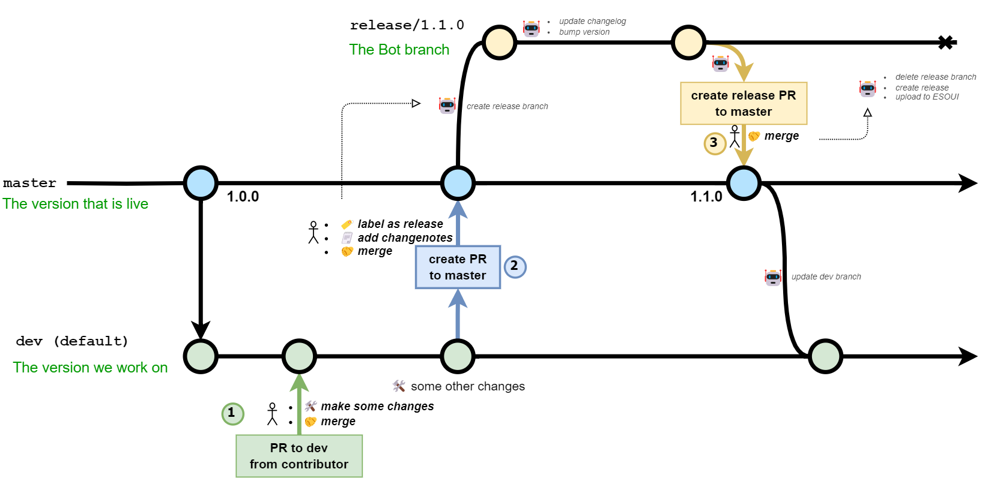

# How to Contribute

It's best to check first before putting too much work into code changes. Because otherwise you won't know beforehand if the feature will make it into the AddOn.

You can:

- open an issue (bug report, or feature request)
- start a discussion here or on ESOUI
- create a small draft PR

## Recommended Update Flow

1. 🍴 **fork** the latest dev branch (default)
   - or create a new branch from dev if you're a maintainer
2. 🛠️ **update** your branch with your changes
   - I recommend a rebase before you make the PR, like `git fetch --all` followed by `git rebase upstream/dev`
    - `upstream` usually means the main repository and `origin` is your fork
    - you can set the upstream like so: `git remote set-url upstream https://github.com/manavortex/FurnitureCatalogue.git`
    - or without setting the upstream: `git pull --rebase https://github.com/manavortex/FurnitureCatalogue.git dev`
3. 📬 send a **PR** pointing to the dev branch
   - if you're not ready yet but want to show or discuss your changes, you can make it a draft PR
4. 🔎 **check** the changes
   - or ask a maintainer for review
   - you can still push changes into your branch, they will also be updated in your PR
5. 🤝 **merge** the PR into dev
   - or lean back and wait for a maintainer to do it
6. 🏁 You did it! Congratulations 🎉
7. ⬇️ if you are a maintainer or you just like reading, you can continue with [Recommended Release Flow](#recommended-release-flow)

# For Maintainers

## 🤝 Merge Strategy

- ⭐ **rebase** (preferred)
  - puts all changes on top of the latest code
  - works best, if you already rebased locally or if there were no changes in the meantime
- **merge** 
  - creates a commit including the changes from the PR
  - makes it easier to retrace steps
- **squash**
  - combines all commits of the PR into one commit to the target branch
  - useful if you want to hide many little commits that don't do much
  - but it's fine, don't worry about spamming, it doesn't have to look pretty
  - the changelog is for looking pretty

## 🌳 Branching Strategy

- 📦 **dev** `PR me` `fork this`
  - the default branch used for staging
  - regular PRs should always point to **dev**
  - used for sorting out PRs and other incoming changes
  - PRs and other branches should always be merged into **dev** first
- 🔐 **master**
  - protected branch, for releases only
  - release PRs should point to **master**
  - maintenance commits like README updates can still be done directly on **master**, no problem (just update **dev** when you're done)
- 🛠️ **other branches**
  - for new features and playing around
  - for longer development
  - if it's just a hotfix, you can use **dev**

### Why?

- ensures the master code is the same as on ESOUI
- makes releases easier to automate
- prevents mistakes
- makes versioning easier, only master bumps versions
- keeps the master branch clean
- avoids people accidentally forking some work in progress
  - they can still do, but on purpose
- extra branches for general development so that:
  - **dev** is not blocked longer than necessary (has to be up to date with **master**)
  - other people can try it out themselves
  - other people don't accidentally pull work in progress

## Recommended Release Flow



The automated release flow has the phases: `Prepare`, `Package` and `Publish`. We only have to take care of merging PRs from contributors **1️⃣**, creating PRs to master **2️⃣** and merging release PRs from the bot **3️⃣** (see diagram above).

To get the bot experience you can follow the recommended steps:

1. 📬 create a PR from **dev** to **master** - **2️⃣**
   - if you are a contributor make the PR to **dev** instead ([see udpate flow](#recommended-update-flow)) - **1️⃣**
2. 🏷️ add label `actions:RELEASE`
   - 🏷️ also add `version:MAJOR` or `version:PATCH` if it applies
3. ☑️ go through **checklist** in [Release Template](.github/pull_request_template.md)
4. 🤝 **merge** PR into master (will trigger [CreateReleasePR](.github/workflows/create_release_pr.yml)) - **2️⃣**
5. 🤖 the next few steps are automated:
   - 🤖 version of main AddOn is increased in all relevant files
   - 🤖 CHANGELOG is updated (if there are notes)
   - 🤖 updated files are commited
   - 🤖 a temporary release branch is created like `release/1.0.0`
   - 🤖 a release PR is created, containing all necessary infos
6. 🔎 **check** the release PR - **3️⃣**
   - 🔎 one last quick check to see if anything broke
   - 🔎 the PR should not have the `actions:RELEASE` label
   - ⚠️ avoid editing notes at this point, as they will not be updated in the changelogs
   - ⏪ if you missed anything just close it, then go back to step 1 with a new PR
7. 🤝 **merge** the release PR into **master** (will trigger [PackageRelease](.github/workflows/package_release.yml)) - **3️⃣**
8. 🤖 only automated steps should follow now
   - 🤖 the AddOn will be packaged into a release zip
   - 🤖 a GitHub release with a version tag will be created and the zip added to it
   - 🤖 [PublishToESOUI](.github/workflows/publish_release.yml) is triggered
   - 🤖 the AddOn and new changelog will be uploaded to ESOUI
   - 🤖 the temporary release branch is deleted
   - 🤖 the dev branch is synced with the master
9. 🔎 quick check on ESOUI to see if it worked

## Additional Info

- **Versioning**:
  - **major**: breaking changes to SavedVars, API functions, the AddOn directory structure or just a lot of code changes altogether
    - increases major version (eg. $1.23.4 \to 2.0.0$)
    - [🏷️](https://github.com/manavortex/FurnitureCatalogue/labels/version%3AMAJOR) `version:MAJOR`
  - **minor**: regular code changes
    - increases minor version (eg. $1.23.4 \to 1.24.0$)
    - [🏷️](https://github.com/manavortex/FurnitureCatalogue/labels/version%3AMINOR) `version:MINOR` (no need to set it, it is the default version increase)
  - **patch**: small incremental changes like DB updates
    - increases patch version (eg. $1.23.4 \to 1.23.5$)
    - [🏷️](https://github.com/manavortex/FurnitureCatalogue/labels/version%3APATCH) `version:PATCH`
  - **AddonVersion**:
    - used by the game client to decide which dependency to load if two have the same name
    - positive number like $12345$
- **merge dev into master**:
  - means the current code of the dev branch will be merged with the current code in master and the changes will be written to the master
  - it looks like this in a GitHub PullRequest:
    - `base: master` ⬅️ `compare: dev`

If some other terms are unclear just feel free to ask and we'll add them here.

---

# IMPORTANT

- the part below may be out of date in some sections
- but it also describes the local development process in more detail so it's worth a look
- the mentioned tools should be up to date and in working order (but there are no guarantees)
- scripts and deployment tools are now in the [.scripts](./.scripts/) folder
- when in doubt, you can just talk to us

## ⬇️⬇️⬇️⬇️⬇️⬇️

# Introduction

This is a guide that assumes you have little to no idea about coding, but want to help. If you know how to achieve the end results, feel free to skip any intermediary steps.

# Prequisites

## Tools:

- an account at github.com (so if you burn out or go MIA, the next volunteer can take over from you)
- Notepad++ for file editing (trust me, it's so much better than regular notepad)
  - VSCode is also a good alternative as it offers IDE and LuaDoc support
- git: https://git-scm.com/download/win.
  - Install with default options, except for "chosing the default editor used by git" - you'll want to select notepad or notepad++
- a client. I'll walk you through how to use https://www.syntevo.com/smartgit/download/ here.

## AddOns:

- sidTools: Required for datamining (getting the furniture items and recipes from code)
  https://www.esoui.com/downloads/info1210-sidTools.html
- LibDebugLogger: You probably already have this. It will make troubleshooting easier.
  https://www.esoui.com/downloads/info2275-LibDebugLogger.html
- DebugLogViewer: Lets you access LibDebugLogger's output. Alternatively, use https://sir.insidi.at/or/logviewer/ after reloadUI. (No, I'm kidding, don't do that.)
  https://www.esoui.com/downloads/info2389-DebugLogViewer.html
- Mer Torchbug (optional): Lets you run scripts inside ESO and display variables and even tables.
  Alternatively, you can run LUA from chat by prefixing it with `/script`, but that is cumbersome.
  https://www.esoui.com/downloads/info2601-MerTorchbug-FixedandImprovedIngamevariableinspectormuchmore.html

**To set up local dependencies/requirements, you can also run `devUtils_setup.cmd`!**

# Grab the code

## 1. Fork it on github

- go to https://github.com/manavortex/FurnitureCatalogue
- the "fork" button is on github, TOPRIGHT corner, directly below your avatar
- this will give you an own copy of my repository: https://github.com/yourusername/FurnitureCatalogue
- You need this because you can't write to mine, and I'm not turning it on for the general public. You push your changes to your copy, then create a pull request. I'll review and put it back into the main code base. :)

## 2. Check out your new fork to your local harddrive

- For this, first delete all the files from the AddOn that you have installed via Minion. (The first step to developing the AddOn is to delete the AddOn!)
  You can get there by pressing windows+R and executing the command `explorer %USERPROFILE%\Documents\Elder Scrolls Online\live\AddOns\FurnitureCatalogue`
- In your browser on github, the green "code" button gives you an URL to copy.
  It will look like `https://github.com/YOUR_USERNAME/FurnitureCatalogue.git`
- Open smartgit. Use the default settings unless indicated otherwise.
  - You're a non-commercial user.
  - Style: You want "Working Tree", I think.
  - Click "Clone a repo".
  - Path: Click "browse", then open the explorer bar and enter `%USERPROFILE%\Documents\Elder Scrolls Online\live\AddOns\FurnitureCatalogue`.
  - URL: the one you copied from the browser in the step above.
- Minion: if you have automatic updates enabled you should tell it to ignore updates to FurnitureCatalogue while you're working on it

## 3. - Optional: Add the original repository as a second upstream.

This allows you to fetch changes from my repository, in case we're working on this together.

- click Remote -> Add -> and enter
  - original
  - https://github.com/manavortex/FurnitureCatalogue.git

# Basics

You don't need to know anything about programming but how to operate it, but this bit here is crucial. Fortunately, it's straightforward as well.

## Table and Key/Value

In LUA, everything is a table. Tables look like this:

```
local tbl = {
	["Key"] = "Value",
}
```

- the key is how you access stuff in the table
- the value is the stored value
- keys are always left of the `=`
- `tbl["Key"]` does the same thing as `tbl.Key`

## Commas

Your `#1` cause of error will be commas. If Lua sees a line ending in a table, it assumes that more table will follow.

Within a table, any lines but the last **must** end with a comma:

```lua
local tblCorrect = {
  key1 = "value1",
  key2 = "value2
}

local tblWrong = {
	key1 = "value1"    -- missing comma here
	key2 = "value2"    -- ESO will complain about this line
}

local tbl3 = { }
```

The last line of a table **need** not end in a comma. Unlike JSON, LUA won't mind, though. On the top level however, tables **must not** be followed by a comma:

```lua
local tblOK = {
  key1 = "value1",
  key2 = "value2",  -- trailing comma inside the table is ok
}

local tblWrong = {
  key1 = "value1",
  key2 = "value2"
},                -- trailing comma outside of tables is not ok

local tbl3 = { }  -- ESO will complain about this line
```

# Set up development stuff

## Copy the required files (or run `devUtils_setup.cmd`)

- copy `Custom.example` to `Custom.lua`

# Extract items

## 1. log in and datamine!

- Run the command `/sidtools items show` or run `/sidtools` and open the "ItemViewer" via menu
- let it scan from Id Range `0` to `200000`
- type `/dumpfurniture`
- Increment the nummeric value in both fields by 200k, rinse and repeat until the window shows up empty or you're bored
- when it's done, reload the UI via `reloadUI`

## 2. grab the stuff from sidTool's saved variables

For now, we will stay in Custom.lua so you can fuck around and find out. As for how to properly set up the files, see below.

- go to `../../SavedVariables/sidTools.lua`
- the relevant entries are `furnitureRecipes` and `furniture`
- fix up the items and recipes (see [Fix up the items](#fix-up-the-items) and [Fix up the recipes](#fix-up-the-recipes) below)
- copy them to the corresponding tables in your `data\Custom.lua`. You'll see differences in formatting – you need to make sure that the generated entries have the same format as the regular ones

### Fix up the items

- mark all the items
  - for Notepad++ fastest way is to click the "-" on the left side and to select the collapsed region
- Press Ctrl+H (Search&Replace)
- Check "In selection"-box
- Select the third entry under "Search Mode": Regular expression

1. Find what: `((?<=\] = )")|(",$)`
2. Replace with: ` ` (nothing)
3. alternative in 1 go, without affecting recipes
   - Find what: `(?<=\[(\d+)\]\s*=\s*)"(\w+),\s*(--\s*.+)",$`
   - Replace with: `$2, $3`

Result:

```lua
-- before:
[123456] = "rumourSource, -- Some, item",

-- after
[123456] = rumourSource, -- Some, item"
```

### Fix up the recipes

- mark all the recipes
  - for Notepad++ fastest way is to click the "-" on the left side and to select the collapsed region
- Press Ctrl+H (Search&Replace)
- Check "In selection"-box
- Select the third entry under "Search Mode": Regular expression

1. Find what: `\[|(\] = "rumourSource)|",$`
2. Replace with: ` ` (nothing)
3. alternative to do it in 1 go without affecting furniture
   - Find what: `(?<=\[(\d+)\]\s*=\s*)"(\d+),\s*(--\s*.+)",$`
   - Replace with: `$1, $3`

Result:

```lua
-- before:
[123456] = "123456, -- Plan: some, plan",

-- after
123456, -- Plan: some, plan
```

# OK, I wanna release! What now?

## 1. Version number

### Create a new constant.

In `FurnitureCatalogue\_Constants.lua`, add a line like this:

```lua
FURC_FOOBAR = FURC_LASTLINE+1 -- <number in previous line +1>
```

The thing on the left of the `=` is your new entry. The thing on the right of the = is the value in the line below.
The comment on the right is to see the number at first glance if you `Ctrl+F` for the constant.

### Add translation constants

#### Menu entry:

In `FurnitureCatalogue\locale\en.lua`, find the list that starts with `SI_FURC_FILTER_VERSION_OFF`.
It should be [around line 223](./locale/en.lua?#L223).
Add `SI_FURC_FILTER_VERSION_FOOBAR` at the end of the block (you can duplicate the previous line), and change the text.

#### Mouseover tooltip:

Now, find the list that starts with `SI_FURC_FILTER_VERSION_OFF_TT`. It should be [around line 265](./locale/en.lua?#L265) somewhere.
Add `SI_FURC_FILTER_VERSION_FOOBAR_TT` at the end of the block (you can duplicate the previous line), and change the text.

### Add the context menu entries.

In `FurnitureCatalogue\startup.lua`, find `FurC.DropdownData` [around line 131](./startup.lua#L131).
At the bottom of each list, add a line with the constant from the previous step.

### You're done!

If you didn't make any mistakes, the new version entry should show up in the dropdown menus now.
If it doesn't, check for spelling mistakes.
If all menu entries are gone, you forgot a comma.

## 2. Put everything from Custom.lua in the right files.

### Items

1. Create a new lua file in the `data/` folder and give it a name that makes sense (after the AddOn). Please don't use spaces!
2. Open [FurnitureCatalogue.txt](./FurnitureCatalogue.txt) and add an entry above `data\$(APIVersion).lua`, but after the other data files. This will tell the game to load it.

This file will hold the item database.

### Recipes

1. Open [data/Recipes.lua](./data/Recipes.lua) and create a new list with your constant as a key. Put the recipes in there.
2. You're done.

### Rolis and Faustina

1. Find [data/Rolis.lua](./data/Rolis.lua) and create a new list with your constant as a key. Create new table entries for each item in their inventory.
2. The key is the item ID, and the value is the number of vouchers they want.

```lua
-- For example:
[159501] = 125, -- Praxis: Khajiit Sigil, Moon Cycle
-- This means that this blueprint costs 125 vouchers
```

## Sharing the changes

### Upload them on github

1. Open the git client of your choice. There should be a panel to the right.
2. Next to "Unstaged changes", click "Stage all changes" or highlight single files and press the button there.
3. Enter a commit message.
4. Click the button below "Commit changes to `<num>` files".
5. Click "Push" in the UI.

### Tell us about them

1. Open your github repository in your browser.
2. Find the second tab "Pull requests" (ctrl+f if the UI confuses you)
3. Click the green "new pull request" button
4. Click on the link "compare across forks"
5. On the left, select "manavortex/FurnitureCatalogue"
6. On the right, select "yourusername/FurnitureCatalogue"
7. Click "Create Pull Request"
8. If you haven't heard from us (or there's a new FurC release) within a week, do get in touch to remind us

# Troubleshooting

If you are running into any problems with FurC data, the answer is going to be "you're missing a comma" in 95% of all cases.

## The UI is showing, but all data is gone!

You're probably missing a comma in one of the data files. That will lead to the scan function failing and an empty database.
To fix this, open DebugViewer and look for the first FurC related error you see.

## I added items to an existing table, but they're not showing up

1: Search for one of the preexisitng items in the table. Does it show up?
Yes: Make sure that you got the nesting right. Everything needs to be on the right level. If you put entries into other entries, they'll be ignored.
No: You're missing a comma.

## Unexpected symbol near `<somewhere>`

If it's not a missing comma, it is probably improper nesting or an unterminated string. Use Notepad++ **code folding** to find the culprit, and look _above_ the line where the error occurred.

1. Make sure that your top level tables do _not_ end with a comma.
   Any table that's assigned (` = {`) needs to close in `}` without a trailing comma. As soon as Lua sees a comma, it will expect more list items. If it gets an assignment instead, it will complain.
2. Make sure that every line _inside_ your tables ends with a comma.
   When a line does not end with a comma, Lua expects the table to close now. If you've forgotten one, it will complain.

In the left margin of the text editor, you will see little `-` icons that collapse a region. Do this, starting at the innermost level of tables, working your way up to the top. You will spot the one where you made a mistake.

## Everything is broken!!! (Unspecified)

Check if `/script d(FurC)` shows an output. If it doesn't, then you (or I via remote debugging) managed to break something in the toplevel folder.
Use your git client to discard (or stash) any changes in the toplevel folder.
