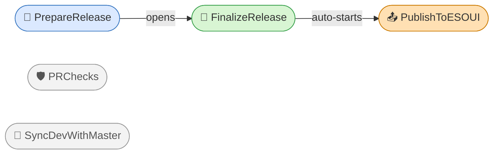
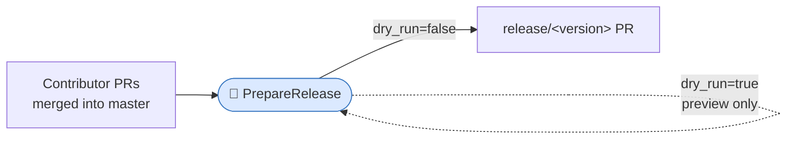
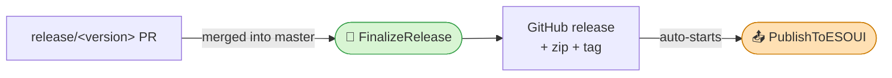
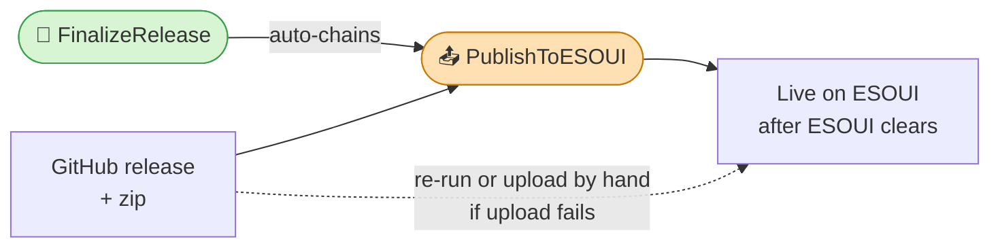
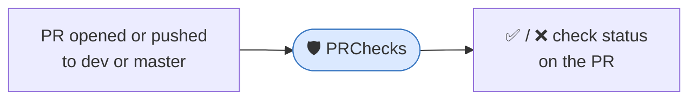
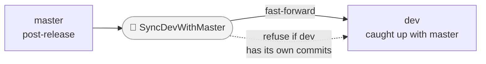

# How to Contribute

It's best to check first before putting too much work into code changes. Because otherwise you won't know beforehand if the feature will make it into the AddOn.

You can:

- open an issue (bug report, or feature request)
- start a discussion here or on ESOUI
- create a small draft PR

<strong>Recommended Update Flow</strong> (click to expand)

1. 🍴 **fork** the latest dev branch (default)
2. 🛠️ **update** your branch with your changes
   - I recommend a rebase before you make the PR, like `git fetch --all` followed by `git rebase upstream/dev`
    - `upstream` usually means the main repository and `origin` is your fork
    - you can set the upstream like so: `git remote set-url upstream https://github.com/manavortex/FurnitureCatalogue.git`
    - or without setting the upstream: `git pull --rebase https://github.com/manavortex/FurnitureCatalogue.git dev`
3. 📬 send a **PR** pointing to the dev branch
4. 🔎 **check** the changes
   - you can still push changes into your branch, they will also be updated in your PR
5. 🤝 **merge** PR into dev (or wait for merge)
6. 🏁 You did it! Congratulations 🎉
7. ⬇️ if you are a maintainer or you just like reading, you can continue with [Recommended Release Flow](#recommended-release-flow)

## Local toolchain

If you want your local formatting+scripts to behave the same way as in the GitHub actions, install the same versions.

- **Python** (see [Python-Action](../.github/actions/setup-python-env/action.yml))
  - `pip install -r .scripts/requirements.txt` to match what the scripts use
  - look at the [Python scripts](../.scripts/) for example usage
- **StyLUA** (see [StyLua-Action](../.github/actions/setup-stylua/action.yml))
  - Download `stylua-<YOUR-OS>-x86_64.zip` from [JohnnyMorganz/StyLua](https://github.com/JohnnyMorganz/StyLua/releases)
  - run `stylua --config-path=stylua.toml .` to format

# For Maintainers

<strong>🤝 Merge Strategy</strong> (click to expand)

- ⭐ **rebase** (preferred)
  - puts all changes on top of the latest code
  - can be more difficult when there are many merge conflicts
  - easier if you regularly `rebase` instead of `pull` to update your local repo
- **merge**
  - creates a commit including the changes from the PR
  - easier conflict resolution compared to `rebase`, if you `pull` regularly
- **squash**
  - combines all commits of the PR into one commit to the target branch
  - useful if you want to combine many little commits that don't do much on their own

<strong>🌳 Branching Strategy</strong> (click to expand)

- 📦 **dev** `PR me` `fork this`
  - the default branch used for staging
  - regular PRs should always point to **dev**
  - most PRs should always be merged into **dev** instead of **master**
  - code here should be in working order so that it can be released at any time
  - should never be behind **master** (except for maintenance updates)
- 🔐 **master**
  - protected branch, for releases only
  - release PRs should point to **master** (usually done by 🤖)
  - maintenance commits like README updates can still be done directly on **master**, no problem (just update **dev** when you're done)
- 🤖 **release/x.y.z**
  - generated by the bot and used to create a PR to `master`
  - automatically deleted after a release
- 🛠️ **other branches**
  - can be used for new features and playing around
  - usually it is a branch on your fork (origin repo)
  - if it's just a hotfix, you can use **dev** directly on the upstream (main repo)

### Why the branches?

- clean master branch and the latest code is just like on ESOUI
- easier versioning, only master bumps versions
- easier release automation
- **dev** being up to date with **master** avoids people accidentally forking work in progress
  - they can still do, but on purpose

## Recommended Release Flow

How the 5 workflows relate. Detail diagrams below zoom into each workflow's immediate context.

```mermaid
flowchart LR
    B(["🚀 PrepareRelease"]) -- opens --> D(["🤖 FinalizeRelease"])
    D -- auto-starts --> F(["📤 PublishToESOUI"])

    C(["🛡️ PRChecks"]):::aux
    S(["🔄 SyncDevWithMaster"]):::aux

    style B fill:#dbe9ff,stroke:#3a78c2
    style D fill:#d8f5d3,stroke:#3aa14d
    style F fill:#ffe0b3,stroke:#cc7a00
    classDef aux fill:#f3f3f3,stroke:#999,color:#555
```

Five workflows. Each is triggered from the **Actions** tab in GitHub - no label discipline, no magic PR-body delimiters.

| Workflow | When | What it does |
|---|---|---|
| [**🚀PrepareRelease**](../.github/workflows/prepare_release.yml) | manual | Pre-flight CI + version bump + regen autocomplete/translations + StyLUA + CHANGELOG + open `release/<version>` PR against master |
| [**🤖FinalizeRelease**](../.github/workflows/finalize_release.yml) | auto, on merge of `release/*` PR | Tags the version, packages the zip, creates a GitHub release, then starts PublishToESOUI |
| [**📤PublishToESOUI**](../.github/workflows/publish_to_esoui.yml) | auto, started by FinalizeRelease (can be manual) | Uploads release zip to ESOUI. Runs after release exists, so a failed upload never forces a re-package |
| [**🛡️PRChecks**](../.github/workflows/pr_ci.yml) | auto, on PR to `dev` or `master` | StyLUA `--check`, manifest validate, package dry-run. Non-blocking by default |
| [**🔄SyncDevWithMaster**](../.github/workflows/sync_dev_with_master.yml) | manual | Fast-forward `dev` to `master`. Refuses if `dev` has commits `master` does not |

### Making a release

1. 📬 Merge the contributor PRs you want to ship into **master**
2. 🚀 Go to **Actions → PrepareRelease → Run workflow**
   - **Impact:** `patch`, `minor` (default), or `major`. Bump is derived from current ESOUI live version
   - **Changelog lines:** `notes1` to `notes7`, one line per field (GitHub actions has no multi-line input 🤷‍♂️). Empty lines ignored; all empty = no CHANGELOG entry this release. Need more than 7 lines? Edit `CHANGELOG` in release PR
   - **Dry run:** Default `true`. The job computes everything, uploads a diff artifact and a summary, but does **not** commit or open a PR. Re-run with `dry_run=false` to actually open release PR
3. 🔎 Review the `release/<version>` PR. Last sanity check
4. 🤝 Merge PR. **FinalizeRelease** auto-triggers from merge, creates GitHub release, then auto-runs **PublishToESOUI**
5. 🌀 When ESOUI clears the upload it shows up in Minion. May take a moment. If upload failed, see PublishToESOUI recovery below (re-run, or hand-upload zip from release)

### 🚀 PrepareRelease

Inputs from dispatch UI: `impact` (patch/minor/major), `notes1` to `notes7` (one changelog line each), `dry_run`. Internally: gets LIVE version from ESOUI -> bump -> regen -> StyLUA -> upload preview artifact (dry-run) or commit + open PR.

```mermaid
flowchart LR
    A[Contributor PRs<br/>merged into master] --> B(["🚀 PrepareRelease"])
    B -. dry_run=true<br/>preview only .-> B
    B -- dry_run=false --> C[release/&lt;version&gt; PR]

    style B fill:#dbe9ff,stroke:#3a78c2
```

**🚑 Recovery - bad release PR:**
1. Close PR
2. delete `release/<version>` branch in GitHub UI
3. fix root cause (or just edit inputs)
4. re-run

### 🤖 FinalizeRelease

Auto-triggers from PR merge - no manual dispatch. If release for tag already exists, the workflow skips cleanly. Checks release branch name against manifest version. When it actually creates release, it starts **PublishToESOUI** afterwards.

```mermaid
flowchart LR
    C[release/&lt;version&gt; PR] -- merged into master --> D(["🤖 FinalizeRelease"])
    D --> E[GitHub release<br/>+ zip + tag]
    E -- auto-starts --> F(["📤 PublishToESOUI"])

    style D fill:#d8f5d3,stroke:#3aa14d
    style F fill:#ffe0b3,stroke:#cc7a00
```

**🚑 Recovery - failed mid-way:**
1. delete the partial release + tag in the GitHub UI
2. merge the same `release/<version>` PR again (re-open if needed)
3. skips cleanly if a release already exists

### 📤 PublishToESOUI

Runs automatically after FinalizeRelease; can also be run manually from Actions tab, if upload failed. Defaults to latest GitHub release. Aborts if manifest version does not match tag, or if live ESOUI version is not lower than manifest version (don't want to re-publish old stuff).

```mermaid
flowchart LR
    D(["🤖 FinalizeRelease"]) -- auto-chains --> F(["📤 PublishToESOUI"])
    E[GitHub release<br/>+ zip] --> F
    F --> G[Live on ESOUI<br/>after ESOUI clears]
    E -. re-run or upload by hand<br/>if upload fails .-> G

    style D fill:#d8f5d3,stroke:#3aa14d
    style F fill:#ffe0b3,stroke:#cc7a00
```

**🚑 Recovery - upload failed:**
1. just re-run workflow
2. If ESOUI API is down or the token broke, grab the zip from the GitHub release page
3. upload zip via the [ESOUI web UI](https://www.esoui.com/downloads/) - no need to re-package

### 🛡️ PRChecks

Runs three parallel jobs (StyLUA `--check`, manifest validate, package dry-run) and reports each as a separate check on the PR. Non-blocking unless you add the job names to branch protection required checks.

```mermaid
flowchart LR
    P[PR opened or pushed<br/>to dev or master] --> C(["🛡️ PRChecks"])
    C --> S[✅ / ❌ check status<br/>on the PR]

    style C fill:#dbe9ff,stroke:#3a78c2
```

**🚑 Recovery - ❌ on a PR:**
1. click into the failing job
2. fix what it flagged
3. ???
4. profit

### 🔄 SyncDevWithMaster

Manual dispatch. Compares `dev` against `master`: fast-forwards when dev is cleanly behind, does nothing when already in sync, refuses + prints a recovery recipe when dev has commits that master does not. `force=true` overrides the refusal with `--force-with-lease` (drops dev-only commits, but still aborts if dev moved during the run)

```mermaid
flowchart LR
    M[master<br/>post-release] --> S(["🔄 SyncDevWithMaster"])
    S -- fast-forward --> D[dev<br/>caught up with master]
    S -. refuse if dev<br/>has its own commits .-> D

    style S fill:#f3f3f3,stroke:#999
```

**Recovery - dev has commits master does not:**
- Workflow refused and printed the dev-only commits in the run summary?
- Three options:
  1. merge master into dev locally + push + re-run
  2. rebase dev onto master
  3. re-run with `force=true` to drop the listed commits (irreversible)

## Additional Info

- **Versioning** (selected via the `impact` input on [PrepareRelease](../.github/workflows/prepare_release.yml)):
  - **major**: breaking changes to SavedVars, API functions, the AddOn directory structure or just a lot of code changes altogether
    - increases major version (eg. $1.23.4 \to 2.0.0$)
  - **minor**: regular code changes (default)
    - increases minor version (eg. $1.23.4 \to 1.24.0$)
  - **patch**: small incremental changes like DB updates
    - increases patch version (eg. $1.23.4 \to 1.23.5$)
  - **maintenance**: just changes in files that are not part of any release. Do not use release workflow for that and don't bump versions
- **AddonVersion**:
  - used by the game client to decide which dependency to load if two have the same name
  - positive number like $12345$
- **merge dev into master**:
  - means the current code of the dev branch will be merged with the current code in master and the changes will be written to the master
  - it looks like this in a GitHub PullRequest:
    - `base: master` ⬅️ `compare: dev`

If some other terms are unclear just feel free to ask and we'll add them here.

---

## Furniture data contributions

For finding missing furniture, correcting sources, or ignoring obsolete item IDs, see the [LFC contribution guide](https://github.com/wookiefriseur/LFC/blob/main/CONTRIBUTING.md).
